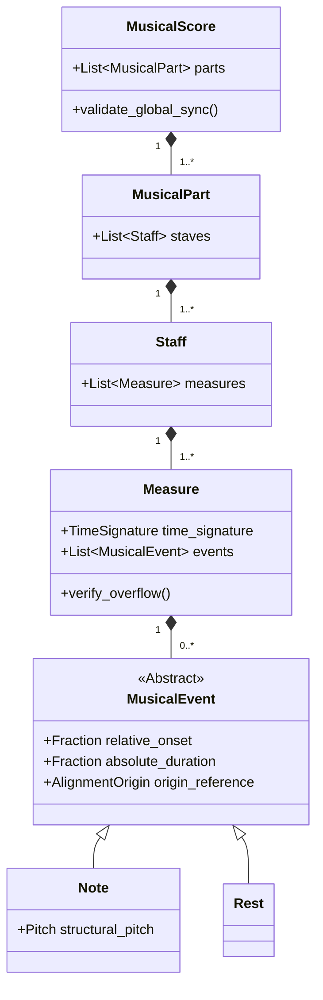

# Diagramação e Mapeamento de Classes

Core relacional de Domínio purista livre de poluição da infraestrutura nativa ao redor (OMR/AMT).

*Nota Base:* Inserção direta de propriedades `origin_reference` capacitam, satisfazem e garantem inegociavelmente o forte critério rastreabilidade imposto pelos *RNF-03 (Observabilidade Transparente)* acoplando a partitura exportada a tela e segundo físico raiz original extraído.
